# photo-lib-organizer

Weekend-ish project that I use to organize a dump of my photos. 

There are a few things that it does at the moment: 

* Scans a directory and builds an index (Filename, location, EXIF information, Hash)
* Detects duplicates based on hash value and build an html page for me to review
* Updates file created dates to photo taken date when mismatch is detected

## Architecture

```mermaid
flowchart TD
    Start([Application Start]) --> WF[WorkflowService\nBackgroundService]

    WF -->|for each configured directory| BIC[BuildIndexCommand]
    
    subgraph indexing ["Phase 1: Build Index"]
        BIC --> BIH[BuildIndexCommandHandler]
        BIH --> CH[Channel&lt;string&gt;\nBounded 1000]
        
        CH -->|Producer| ENUM[Enumerate files\nin directory]
        ENUM -->|file paths| CH
        
        CH -->|10 Consumer tasks| EXT[ExtractDataFromFileCommand]
        
        subgraph extraction ["Data Extraction"]
            EXT --> EXTH[ExtractDataFromFileCommandHandler]
            EXTH --> FDE[FileDataExtractorService]
            
            FDE --> EXIF[Read EXIF metadata\nDate, GPS coords]
            FDE --> FNP[FileNameParser\nFallback date extraction]
            FDE --> HASH[Calculate MD5 hash]
            
            EXIF --> PF[PhotoFile entity]
            FNP --> PF
            HASH --> PF
        end
        
        PF --> COU[CreateOrUpdateFileCommand]
        COU --> COUH[CreateOrUpdateFileCommandHandler]
        COUH --> DB[(MS SQL\nPhotoFiles)]
    end

    WF -->|after indexing| UFD[UpdateFileCreatedDatesCommand]
    
    subgraph datefix ["Phase 2: Fix File Dates"]
        UFD --> UFDH[UpdateFileCreatedDatesCommandHandler]
        UFDH --> QUERY[Query files where\nPhotoTaken ≠ FileCreated]
        QUERY --> DB
        DB --> CH2[Channel&lt;FileData&gt;\nBounded 1000]
        CH2 -->|10 Consumer tasks| SETDATE[Set file creation time\nto PhotoTaken date]
    end

    style indexing fill:#e8f4f8,stroke:#2196F3
    style extraction fill:#fff3e0,stroke:#FF9800
    style datefix fill:#e8f5e9,stroke:#4CAF50
```

## Tech stack

* .NET 10
* MS SQL

## Plans

* Remove duplicates ✨
* Sort and group files by
  * Year-month taken 📆
  * Location 🌍

This project is built with 💖 and  Copilot.
